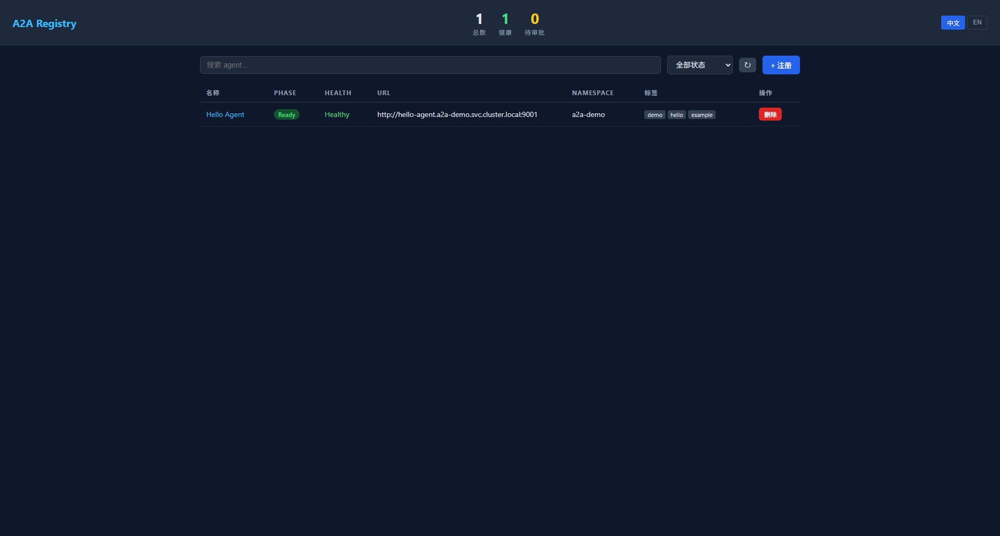

# A2A Registry
English Version | [中文版](README_zh.md) | [日本語版](README_ja.md)

[](https://go.dev/)
[](https://kubernetes.io/)
[](LICENSE)

A **Kubernetes-native Agent Registry** for the [Agent-to-Agent (A2A) protocol](https://github.com/google/A2A) — an open standard by Google for enabling direct agent-to-agent communication.

Built with the [kubebuilder](https://github.com/kubernetes-sigs/kubebuilder) framework, a2a-registry extends Kubernetes with Custom Resource Definitions (CRDs) to manage agent registration, discovery, health checking, and search — all within your cluster.

---

## Table of Contents

- [Features](#features)
- [Architecture](#architecture)
- [Quick Start](#quick-start)
- [Installation](#installation)
- [Usage](#usage)
  - [Creating a Registry](#creating-a-registry)
  - [Registering an Agent](#registering-an-agent)
  - [Discovering Agents via the API](#discovering-agents-via-the-api)
  - [Agent Approval Workflow](#agent-approval-workflow)
  - [Authenticated Agent Cards](#authenticated-agent-cards)
- [API Reference](#api-reference)
- [Configuration](#configuration)
- [Monitoring](#monitoring)
- [Development](#development)
- [Examples](#examples)
- [License](#license)

---

## Features

- **Kubernetes-native** — Agents are defined as CRDs (`A2AAgent`, `A2ARegistry`). No external database needed; Kubernetes is the source of truth.
- **HTTP Registration API** — Agents can self-register via `POST /api/v1/agents` and deregister via `DELETE /api/v1/agents/{name}`, in addition to `kubectl apply`.
- **Automatic Health Checking** — Periodically fetches each agent's [Agent Card](https://github.com/google/A2A/blob/main/specification/a2a.json) from `/.well-known/agent-card.json` and tracks lifecycle phases: `Pending → Ready → Error → Unreachable`.
- **Configurable Failure Threshold** — Per-agent `failureThreshold` controls how many consecutive failures before an agent is marked `Unreachable`.
- **URL Conflict Detection** — Prevents duplicate agent URLs from polluting the registry. Conflicting agents are marked `Error`.
- **Built-in Discovery API** — A RESTful HTTP API server (port `8082`) runs inside the operator, exposing endpoints for agent listing, search, registration, and card retrieval.
- **Flexible Discovery Scope** — Configure discovery at `Cluster` or `Namespace` level, with label selectors and namespace filters — both enforced at the API level and the Kubernetes API level.
- **Registration Policies** — Fine-grained control over `requireApproval`, `requireHealthCheck`, and `requireCardMatch` per registry.
- **Global Health Check Defaults** — Set cluster-wide default health check interval and timeout via the `A2ARegistry` CR or Dashboard settings. Per-agent overrides take higher priority.
- **Dashboard Settings UI** — Configure global health check defaults, registration policies, and approval toggles directly from the Dashboard (gear icon).
- **Card Matching** — Optionally validates that a fetched agent card matches the CR spec (name, description, version, skills).
- **Approval Workflow** — When `requireApproval` is enabled, new agents stay `Pending` until an operator adds an `Approved` condition.
- **Agent Auto-Pruning** — Agents that remain `Unreachable` for 7 consecutive days are automatically removed.
- **Authentication Support** — Agents behind authenticated endpoints (bearer token, basic auth) can be health-checked by referencing a Kubernetes Secret.
- **Admission Webhooks** — Validating and mutating webhooks enforce spec correctness for both `A2AAgent` and `A2ARegistry` resources, with CRD-level schema validation as a safety net.
- **Multi-Architecture** — Pre-built Docker images support `linux/amd64` and `linux/arm64`.
- **Prometheus Metrics** — Exposes metrics on port `8080` for monitoring (agent counts, health check latency/failures, registrations, API latency).
- **Kubernetes Events** — Key state transitions (Ready, Unreachable, CardMismatch, AgentPruned) emit Kubernetes Events for audit trails.
- **Leader Election** — Optional leader election for HA deployments.

---

## Architecture

```
┌─────────────────────────────────────────────────────┐
│                  Kubernetes Cluster                  │
│                                                      │
│  ┌──────────────────────────────────────────────┐   │
│  │           a2a-registry (Operator)             │   │
│  │                                               │   │
│  │  ┌─────────────┐  ┌──────────────┐           │   │
│  │  │  A2AAgent   │  │ A2ARegistry  │           │   │
│  │  │ Controller  │  │  Controller  │           │   │
│  │  └──────┬──────┘  └──────┬───────┘           │   │
│  │         │                │                    │   │
│  │         ▼                ▼                    │   │
│  │  ┌─────────────┐  ┌──────────────┐           │   │
│  │  │   Health    │  │   Registry   │           │   │
│  │  │   Checker   │  │   API Server │           │   │
│  │  └──────┬──────┘  │   (:8082)    │           │   │
│  │         │         └──────┬───────┘           │   │
│  └─────────┼────────────────┼───────────────────┘   │
│            │                │                        │
│            ▼                ▼                        │
│  ┌──────────────────┐  ┌──────────────────┐         │
│  │   Agent Pod A    │  │  External Client  │        │
│  │  /.well-known/   │  │  POST /api/v1/    │        │
│  │  agent-card.json │  │  agents           │        │
│  └──────────────────┘  └──────────────────┘         │
│                                                      │
│  ┌──────────────────┐                               │
│  │   Agent Pod B    │                               │
│  │  /.well-known/   │                               │
│  │  agent-card.json │                               │
│  └──────────────────┘                               │
└─────────────────────────────────────────────────────┘
```

**Key components:**

| Component | Description |
|---|---|
| **A2AAgent Controller** | Watches `A2AAgent` CRs, performs health checks by fetching agent cards, enforces registration policies (approval, card matching, URL uniqueness), updates status conditions and phase. |
| **A2ARegistry Controller** | Watches `A2ARegistry` CRs, counts registered/healthy agents, pushes discovery configuration to the API server, auto-prunes stale unreachable agents. |
| **Registry API Server** | HTTP server that serves the registry's own Agent Card, provides agent discovery/search endpoints, and handles agent registration/deregistration via HTTP. Runs on all replicas (no leader election required). |
| **Agent Card Resolver** | Fetches and parses agent cards from `/.well-known/agent-card.json` (with fallback to `/.well-known/agent.json`). Supports bearer token and basic authentication. |
| **Admission Webhooks** | Validate and default specs for both `A2AAgent` and `A2ARegistry` resources on create/update. |
| **Metrics & Events** | Prometheus metrics on `:8080` for agent counts, health check latency, registrations, and API latency. Kubernetes Events emitted for lifecycle transitions. |

---

## Quick Start

### Prerequisites

- Go 1.25+
- A running Kubernetes cluster (v1.27+)
- `kubectl` configured with cluster access
- `kustomize` (for deployment)

### 1. Install the CRDs and deploy the operator

```bash
git clone https://github.com/terminus-io/a2a-registry.git
cd a2a-registry

# Install CRDs
make install

# Deploy the operator
make deploy
```

### 2. Create a registry

```bash
kubectl apply -f config/samples/a2a.io_v1_a2aregistry.yaml
```

### 3. Register an agent

```bash
# Via kubectl
kubectl apply -f config/samples/a2a.io_v1_a2aagent.yaml

# OR via the HTTP API
kubectl port-forward -n a2a-registry-system svc/a2a-registry-controller-manager 8082:8082
curl -X POST http://localhost:8082/api/v1/agents \
  -H "Content-Type: application/json" \
  -d '{
    "namespace": "outbound-agent",
    "name": "My Agent",
    "url": "http://my-agent.default.svc.cluster.local:9001",
    "skills": [{"id": "hello", "name": "Hello"}],
    "tags": ["demo"]
  }'
```

### 4. Query the registry API

```bash
# List all agents
curl http://localhost:8082/api/v1/agents

# Search agents
curl "http://localhost:8082/api/v1/search?q=hello&tag=demo"

# Get registry's own agent card
curl http://localhost:8082/.well-known/agent-card.json
```

### 5. Dashboard

Visit `http://localhost:8082/` to open the Dashboard, with agent listing, search, registration, approval, detail view, **global settings** (health check interval, registration policies, approval toggle), and i18n (zh/en) support.



---

## Installation

### From source

```bash
make build          # builds bin/manager
make docker-build   # builds the Docker image
make docker-push    # pushes to your registry
```

### Using pre-built images

```bash
export IMG=your-registry/a2a-registry:latest
make docker-build
make docker-push
make deploy
```

### Multi-arch build

```bash
make docker-buildx PLATFORMS=linux/amd64,linux/arm64
```

### Uninstall

```bash
make undeploy       # removes the operator deployment
make uninstall      # removes CRDs
```

---

## Usage

### Creating a Registry

The `A2ARegistry` resource is cluster-scoped and defines global settings for agent discovery, registration policies, and the API server.

```yaml
apiVersion: a2a.io/v1
kind: A2ARegistry
metadata:
  name: default-registry
spec:
  discovery:
    scope: "Cluster"           # "Cluster" or "Namespace"
    labelSelector: "app=my-agent"
    # namespaces: ["ns1", "ns2"]
  registration:
    requireApproval: false     # Require manual approval for new agents
    requireHealthCheck: true   # Require reachable URL before marking Ready
    requireCardMatch: false    # Validate fetched card matches spec
  healthCheck:
    intervalSeconds: 120       # Cluster-wide default interval
    timeoutSeconds: 15
  apiServer:
    port: 8082
    bindAddress: "0.0.0.0"
    # tlsCertRef:              # Optional TLS certificate
    #   name: registry-tls
```

**Registration policies:**

| Field | Default | Description |
|---|---|---|
| `requireApproval` | `false` | When true, new agents stay `Pending` until an operator adds an `Approved` condition to their status. |
| `requireHealthCheck` | `true` | When false, agents are marked `Ready` immediately without health checks. |
| `requireCardMatch` | `false` | When true, the fetched agent card must match the CR spec (name, description, version, skills). Mismatches cause `Error` phase. |

**Health check defaults (cluster-wide):**

| Field | Default | Description |
|---|---|---|
| `spec.healthCheck.intervalSeconds` | `60` | Default health check interval. Set via CR or Dashboard settings. Minimum: `1`. |
| `spec.healthCheck.timeoutSeconds` | `10` | Default health check timeout. Must not exceed the interval. |

> **Priority:** Per-agent `spec.healthCheck` > global `A2ARegistry.spec.healthCheck` > hardcoded fallback (60s).
>
> Global defaults can also be configured via the **Dashboard settings UI** (gear icon), which updates the `A2ARegistry` CR via `PUT /api/v1/config`.

### Registering an Agent

An `A2AAgent` resource represents a single A2A agent in the cluster. It is namespaced.

```yaml
apiVersion: a2a.io/v1
kind: A2AAgent
metadata:
  name: hello-world-agent
  namespace: outbound-agent
spec:
  name: "Hello World Agent"
  description: "A simple example agent that returns greetings"
  version: "1.0.0"
  url: "http://agent-service.default.svc.cluster.local:9001"
  capabilities:
    streaming: true
    pushNotifications: false
  skills:
    - id: "hello_world"
      name: "Hello, world!"
      description: "Returns a greeting message"
      tags:
        - "greeting"
        - "demo"
      examples:
        - "hi"
        - "hello"
  defaultInputModes:
    - "text"
  defaultOutputModes:
    - "text"
  protocolVersion: "1.0"
  tags:
    - "demo"
    - "example"
  enabled: true
  authentication:
    schemes:
      - "bearer"
    secretRef:
      name: "my-agent-credentials"
  healthCheck:
    intervalSeconds: 60
    timeoutSeconds: 10
    failureThreshold: 3
```

**Key fields:**

| Field | Description |
|---|---|
| `spec.url` | Base endpoint URL of the agent (must be `http://` or `https://`) |
| `spec.skills` | List of skills the agent can perform, each with a unique `id` |
| `spec.enabled` | Set to `false` to disable health checking and remove from discovery |
| `spec.capabilities` | Declare `streaming` and/or `pushNotifications` support |
| `spec.authentication` | Optional authentication config (`schemes` + `secretRef`) for health-checking protected agent endpoints |
| `spec.healthCheck` | Per-agent health check override (defaults: interval=60s, timeout=10s, failureThreshold=3). If not set, falls back to the global `A2ARegistry.spec.healthCheck`. |
| `spec.healthCheck.intervalSeconds` | Overrides the global default health check interval. Priority: per-agent > global registry > 60s. |
| `spec.healthCheck.failureThreshold` | Consecutive failures before agent becomes `Unreachable` (default: 3) |
| `spec.tags` | Arbitrary tags for searching and filtering |

**Status fields:**

| Field | Description |
|---|---|
| `status.phase` | Lifecycle phase: `Pending`, `Ready`, `Error`, `Unreachable` |
| `status.health` | Health: `Healthy`, `Unhealthy`, `Unknown` |
| `status.lastHeartbeat` | Timestamp of the last successful health check |
| `status.agentCardHash` | SHA256 hash of the fetched agent card |
| `status.consecutiveFailures` | Number of consecutive failed health checks |
| `status.registeredAt` | Timestamp when the agent was first registered |
| `status.conditions` | Kubernetes standard conditions (`HealthChecked`, `Ready`, `Approved`) |

### Discovering Agents via the API

The registry API server exposes the following endpoints:

#### List agents

```bash
GET /api/v1/agents
GET /api/v1/agents?namespace=default
GET /api/v1/agents?tags=demo,example
GET /api/v1/agents?skill=hello_world
```

#### Register an agent

> `namespace` is optional. If omitted or empty, the agent is created in the **`outbound-agent`** namespace (auto-created by the operator). You can also specify your own namespace.

```bash
POST /api/v1/agents
Content-Type: application/json

{
  "name": "My Agent",
  "namespace": "outbound-agent",
  "url": "http://agent.default.svc.cluster.local:9001",
  "description": "An example agent",
  "version": "1.0.0",
  "skills": [
    {"id": "greeting", "name": "Greeting"}
  ],
  "tags": ["demo"],
  "streaming": false,
  "pushNotifications": false,
  "protocolVersion": "1.0"
}
```

#### Get a specific agent

```bash
GET /api/v1/agents/{name}
GET /api/v1/agents/{name}/card    # Returns the A2A Agent Card
```

#### Deregister an agent

```bash
DELETE /api/v1/agents/{name}?namespace=default
```

#### Search agents

```bash
GET /api/v1/search?q=hello                  # Free-text search
GET /api/v1/search?tag=demo                 # Filter by tag
GET /api/v1/search?skill=hello_world        # Filter by skill
GET /api/v1/search?capability=streaming     # Filter by capability
```

#### Registry's own Agent Card

```bash
GET /.well-known/agent-card.json
GET /.well-known/agent.json
```

The registry advertises itself as an agent with "Agent Discovery" and "Agent Search" skills.

### Agent Approval Workflow

When `registration.requireApproval` is enabled in the registry config:

1. New agents are created in `Pending` phase with status `"Waiting for approval."`
2. An operator approves the agent by patching its status:

```bash
kubectl patch a2aa my-agent --type=merge --subresource=status -p \
  '{"status":{"conditions":[{"type":"Approved","status":"True","reason":"Approved","message":"Agent approved."}]}}'
```

3. The next reconciliation detects the `Approved` condition and proceeds with health checks.

### Authenticated Agent Cards

If an agent's `/.well-known/agent-card.json` requires authentication:

```yaml
spec:
  authentication:
    schemes:
      - "bearer"              # or "basic"
    secretRef:
      name: "agent-auth"      # Kubernetes Secret in the same namespace
```

**Bearer token secret:**

```yaml
apiVersion: v1
kind: Secret
metadata:
  name: agent-auth
type: Opaque
stringData:
  token: "my-bearer-token"
```

**Basic auth secret:**

```yaml
apiVersion: v1
kind: Secret
metadata:
  name: agent-auth
type: Opaque
stringData:
  username: "myuser"
  password: "mypass"
```

---

## API Reference

### Custom Resource Definitions

| CRD | Scope | Short Name | Description |
|---|---|---|---|
| `A2AAgent` | Namespaced | `a2aa` | Represents a registered A2A agent |
| `A2ARegistry` | Cluster | `a2areg` | Global registry configuration |

### kubectl Shortcuts

```bash
kubectl get a2aa                    # List all A2AAgents
kubectl get a2areg                  # List all A2ARegistries
kubectl describe a2aa <name>        # Describe an agent
kubectl get a2aa -o wide            # Show additional columns (Phase, Health, URL)
```

### Agent Lifecycle

```
  [Create] ──► Pending ──► Ready ◄──── health check passes
                  │            │
                  ▼            ▼
                Error    Unreachable
                  │            │
                  └─────┬──────┘
                        ▼
                      Ready (after recovery)
```

- **Pending**: Initial state, or waiting for approval, or manually disabled.
- **Ready**: Health check passed; agent is discoverable.
- **Error**: Health check failed (fewer than `failureThreshold` consecutive failures).
- **Unreachable**: Health check failed for `failureThreshold` consecutive times. After 7 days in this state, the agent is automatically pruned.

### HTTP API Endpoints

| Method | Path | Description |
|---|---|---|
| `GET` | `/api/v1/agents` | List all agents (filters: `?namespace=`, `?tags=`, `?skill=`) |
| `POST` | `/api/v1/agents` | Register a new agent (JSON body) |
| `GET` | `/api/v1/agents/{name}` | Get a single agent |
| `DELETE` | `/api/v1/agents/{name}` | Deregister an agent |
| `GET` | `/api/v1/agents/{name}/card` | Get an agent's A2A Agent Card |
| `GET` | `/api/v1/search` | Search agents (`?q=`, `?tag=`, `?skill=`, `?capability=`) |
| `GET` | `/api/v1/config` | Get registry configuration (policies, health check defaults) |
| `PUT` | `/api/v1/config` | Update registry configuration (Dashboard settings) |
| `GET` | `/.well-known/agent-card.json` | Registry's own Agent Card |
| `GET` | `/.well-known/agent.json` | Registry's Agent Card (legacy path) |

---

## Configuration

### Operator Flags

| Flag | Default | Description |
|---|---|---|
| `--metrics-bind-address` | `:8080` | Prometheus metrics endpoint |
| `--health-probe-bind-address` | `:8081` | Health/readiness probe endpoint |
| `--registry-api-bind-address` | `:8082` | Registry discovery API |
| `--leader-elect` | `false` | Enable leader election |
| `--leader-election-id` | `a2a-registry` | Leader election identity |

### Environment Variables

| Variable | Default | Description |
|---|---|---|
| `ENABLE_WEBHOOKS` | (enabled) | Set to `"false"` to disable admission webhooks |

---

## Monitoring

### Prometheus Metrics

All metrics are exposed on port `:8080` with the `a2a_registry_` prefix.

| Metric | Type | Labels | Description |
|---|---|---|---|
| `a2a_registry_agent_count` | GaugeVec | `phase`, `health` | Number of agents by phase and health |
| `a2a_registry_health_check_duration_seconds` | Histogram | — | Agent health check latency |
| `a2a_registry_health_check_failures_total` | Counter | — | Total failed health checks |
| `a2a_registry_agent_card_fetch_errors_total` | Counter | — | Total agent card fetch errors |
| `a2a_registry_registrations_total` | Counter | — | Total agent registrations |
| `a2a_registry_deregistrations_total` | Counter | — | Total agent deregistrations |
| `a2a_registry_api_request_duration_seconds` | HistogramVec | `endpoint`, `method` | Registry API request latency |

### Kubernetes Events

State transitions emit Kubernetes Events visible via `kubectl describe a2aa <name>`:

| Event | Type | Meaning |
|---|---|---|
| `FinalizerRemoved` | Normal | Agent deletion completed |
| `HealthCheckRecovered` | Normal | Agent recovered from Error/Unreachable to Ready |
| `CardMismatch` | Warning | Fetched card doesn't match spec |
| `HealthCheckFailed` | Warning | Single health check failure |
| `AgentUnreachable` | Warning | Agent marked Unreachable after threshold failures |
| `AgentPruned` | Normal | Stale agent auto-removed after 7 days |

---

## Development

```bash
make build          # Build the binary
make run            # Run locally (outside cluster)
make test           # Run tests with envtest
make generate manifests  # Generate CRD manifests and DeepCopy methods
make fmt            # Format code
make vet            # Vet code

# Build and push Docker image
export IMG=your-registry/a2a-registry:latest
make docker-build
make docker-push
```

### Project structure

```
.
├── api/v1/                    # CRD type definitions + webhooks
├── cmd/manager/               # Operator entry point
├── config/
│   ├── crd/bases/             # Generated CRD YAML manifests
│   ├── rbac/                  # RBAC roles and bindings
│   ├── manager/               # Deployment manifest
│   ├── default/               # Top-level kustomization
│   └── samples/               # Example CRs
├── controllers/               # Reconciliation logic
├── internal/
│   ├── healthcheck/           # Agent health checking
│   ├── metrics/               # Prometheus metrics definitions
│   └── registry/              # API server + handler + agent card resolver
├── examples/hello-agent/      # Example A2A agent
├── deploy/helm/a2a-registry/  # Helm chart
├── vendor/                    # Vendored dependencies
├── Dockerfile                 # Multi-stage container build
└── Makefile                   # Build & deploy targets
```

---

## Examples

The [`examples/hello-agent/`](examples/hello-agent/) directory contains a fully functional A2A agent implementation:

- Serves an Agent Card at `/.well-known/agent-card.json`
- Accepts JSON-RPC invocations at `/invoke`
- Includes a complete `deploy.yaml` (Namespace, Deployment, Service, and A2AAgent CR)

```bash
cd examples/hello-agent
kubectl apply -f deploy.yaml
```

---

## Related Projects

- [A2A Protocol Specification](https://github.com/google/A2A) — The open standard for agent-to-agent communication
- [a2a-go](https://github.com/a2aproject/a2a-go) — Go SDK for the A2A protocol
- [kubebuilder](https://github.com/kubernetes-sigs/kubebuilder) — Framework for building Kubernetes operators

---

## License

This project is licensed under the Apache License 2.0. See [LICENSE](LICENSE) for details.
